# Dungeon Gourmet
# Members
ai22m025 - Lukas Hartinger  
ai22m012 - Nico Winter  
ai22m007 - Philipp Lakheshar  

__Summary:__ Dungeon Gourmet is a roguelike action RPG implemented in the Unreal engine 5.2. In the game a meowster chef, armed with a giant cleaver and his throwing forks, embarks on a quest for the ultimate recipe. However, to his surprise, he encounters never-ending hordes of enemies, in which each wave he survives grants him one of three bonuses that make him stronger on his further journey.  

__Zusammenfassung:__ Dungeon Gourmet ist ein roguelike Action-RPG, das in der Unreal Engine 5.2 umgesetzt wurde. In dem Spiel begibt sich ein miausterhafter Koch, bewaffnet mit einem riesigen Hackbeil und seinen Wurfgabeln, auf die Suche nach dem ultimativen Rezept. Zu seiner Überraschung trifft er jedoch auf nicht enden wollende Horden von Feinden, wobei ihm jede überlebte Welle einen von drei Boni gewährt, die ihn auf seiner weiteren Reise stärker machen.

# Original Concept
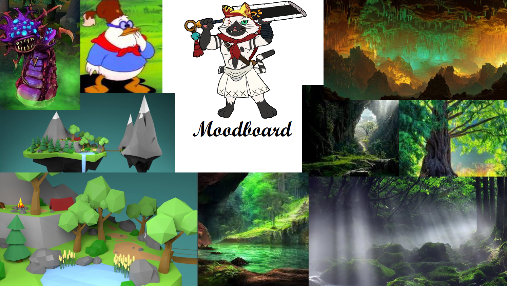

## Idea
Our original idea was a rougelite action RPG with two gameplay loops, an inner (main) gameplay loop that lets the player slay enemies in an outdoor dungeon, with the player receiving loop-instanced upgrades after each wave, and a persistent outer loop that allows the player to combine and use loot obtained in the main loop to obtain permanent power-ups or change the overall gameplay. Due to time constraints, we have not implemented the outer game loop, but the game can still be expanded to include it.

## Genre & Target Audience
Roguelike Action RPG with top-down view. We want to appeal to casual players with the accessible; child-friendly art style and non-casual players with the restrictive combat system. We aim for a medium difficulty level that neither discourages nor bores either group. 

## Gameplay Feeling
Heavy, calculated gameplay where every move counts. The weight of the sword and the body type of the cat chef should be reflected in the gaming experience.

## Art Style
Low-poly assets with warm colors. Outside dungeons rather than indoors, but still quite mysterious and with high contrast. The main character is
different from the world around him due to the strong contrast and different color scheme
around him. The world is 3D, low-poly and cartoony. See the moodboard.

## Platform
Windows

## Development Environment
The game was implemented in Unreal 5.2.  
A possible switch to Unity was considered, but ultimately discarded due to time constraints. If we were to start from scratch, Unity seems more suitable in retrospect.

# Implemented Features
## Basic Movement & Camera Settings
__Location:__ DungeonGourmet/Content/Characters/MainCharacter/BP_ThirdPersonCharacter

### Movement
The basic movement is based on the position and orientation of the camera. The player can use the W, A, S, D keys to move on a plane parallel to the XY plane. We simply use the xy parts of the camera's forward vector and normalize them to get the direction we want our character to move when we make the up/down and left/right inputs. Everything else is done automatically by UE. We initially implemented this to only go in +/- x/y direction, but when we changed the camera perspective, it was pretty obvious that the previous implementation wouldn't be enough.

### Camera
As we want to have a top-down roguelike, we had to move the camera in a fairly specific way. It is centered a bit away, centered on our main character and supports a fairly wide FOV, as the world surrounding our character could not be seen otherwise.  
We also used the camera's post-processing options to give our game more of the look and color scheme suggested in our GDD's mood board. To do this, we applied gamma correction, additional gain and color offset. This initially resulted in a more earthy, green look, which was desirable as we were aiming for a more nature-like appearance, but it proved to be hard on the eyes, so after some trial and error we adjusted the parameters to a more neutral and not too contrasty look.

## Level
The level consists of a single large playing field, with a more or less safe starting area. The level is designed to be close to nature and should depict a forrest next to a mountain range. Originally we had planned to create multiple instanced dungeon rooms and implemented a level streaming feature with camera fade-out, but we abandoned this idea midway through  and focused on one level (Level1). The remnants (dead code) of the previous implementation can be found in the blueprints of the Persistent, Dungeon Room1 and Start Wold levels.

__Location:__ DungeonGourmet/Content/Levels/Level1;  DungeonGourmet/Content/LevelPrototyping/** (assets);

### Landscape
The landscape has been designed using the landscape editor of unreal engine. The "textures" are 4 different materials, which all are just flat colors: Grass, Path (brown), Mountain and Snow. The material has a normal and tangent map based on the X and Y coordinates crossed, to give the blocky visual effect. 
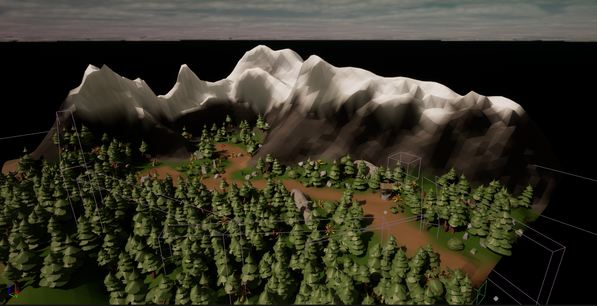
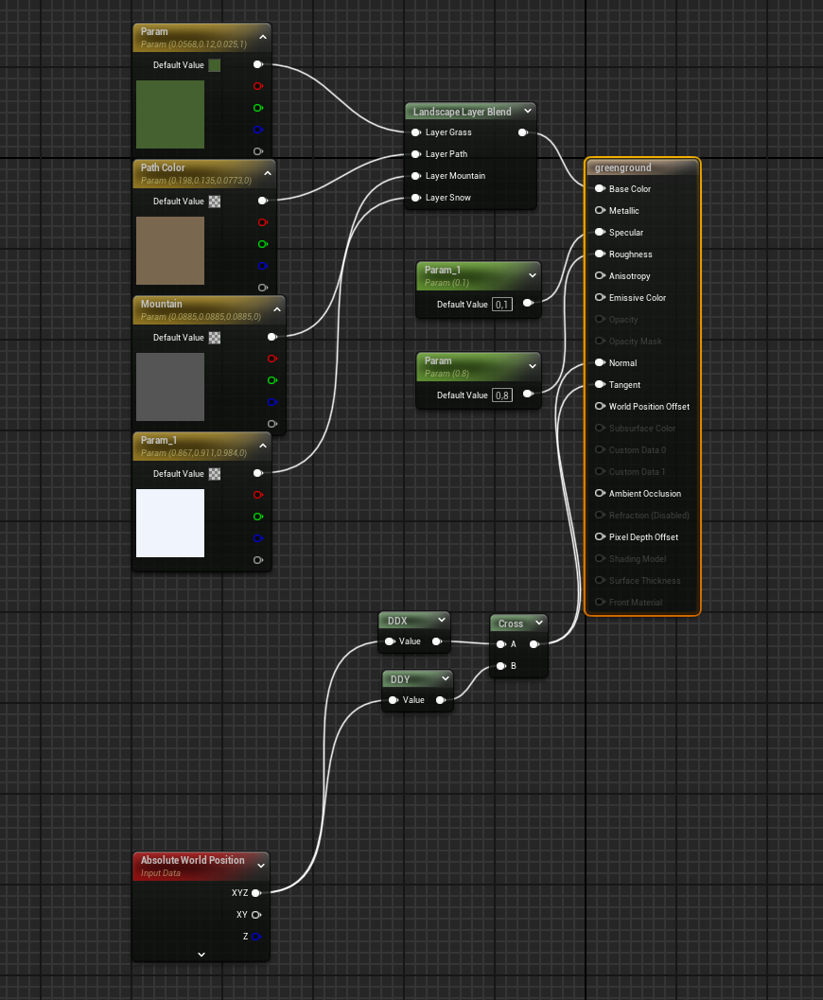

For the entry area, invisible walls are used, as otherwise the player could leave the playing area. Placing trees there would not have made sense, as otherwise there would be no way for the meowsterful chef to enter or leave the area in which the game takes place.

### Landscape details
The trees, rocks and bushes have mainly been placed using UE5s mesh paint tool. Most big assets cannot be walked through by the player, ensuring a solid playing area. Some rocks and other assets (like the well), mainly the bigger ones, have been placed by hand. The assets have been taken from itch.io and are free to use. 

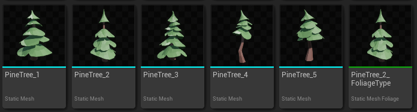 
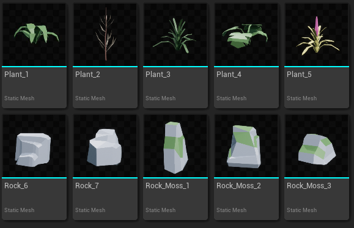 

## Main Character
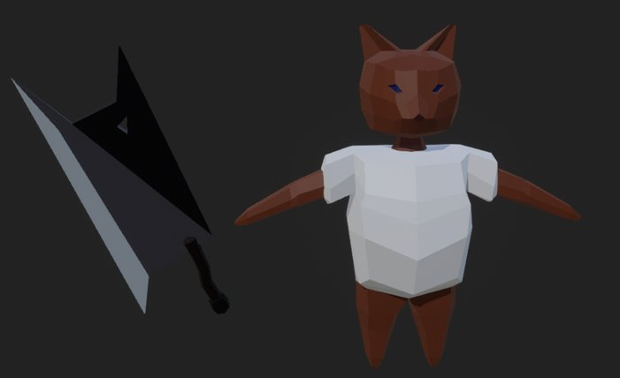

__Location:__ DungeonGourmet/Content/Character/MainCharacter/**; Models/mainCharacter; Models/BroadSword (.fbx, .blend files);  

The main character, main weapon, and throwing knives have been modeled using blender. There was some experience using modelling software and modelling characters specifically. That was however mainly in Maya, the transition to blender was therefore not that easy. There were 2 iterations of the main character, with the second one being the one in the game.

We thought that having a toon/low-poly look would work well for our current level of artistic knowledge. The model is supposed to look like a cat in a white cooking robe. The full model and blender file can be found under models/mainCharacter. The character was mainly created by using the knife and extrusion tools and shoving vertices around.

We also tried to rig the character manually, which actually worked pretty well. When trying to use the rigged model with Mixamo to get some animations, it broke. After some searching around, it was clear that we had to let mixamo create the bones for us, requiring us to remove the bones again.

The main character has a socket on his right arm to hold the sword. Sadly, as the arms of our character are currently too short, he does not hold the sword properly. Due to the camera perspective this is barely visible however. During BeginPlay inside BP_ThirdPersonCharacter the sword is created and put onto the socket. The sword is saved to be used during the attack calculations.

### Main Character Animations
The animations of the main character all come from mixamo. We chose to use the "Greatsword pack" which contains many animations which would be relevant to our game. All animation files can be found inside unreal under Content/characters/mainCharacter/animations.

The roll and attack animation are played using montages, as they are typically only played once and should override all other animations.

The idle-walk-run animations are contained in a blendspace "BS_Walk", to allow smooth blending of the animations given the speed of the main character.

The animations are merged in "ABP_MainCharacter". Here, we have a fullBodySlot for the roll animation and an upperBodySlot for the attack animation. This allows the character to roll with the whole body and to attack while walking around. The base pose that is supplied is what is output by BS_Walk.

### Dodge Roll
The functionality behind the dodge roll is implemented on BP_ThirdPersonCharacter. The dodge is triggered when pressing the space key on keyboard.

The logic first checks whether the dodge is on cooldown and whether another animation is currently playing. If neither is the case, the dodge animation montage is played and the dodge cooldown is set. During the dodge animation, a timeline is used to propell the character forward by changing its velocity.

### Slash Attack

The functionality behind the slash attack is implemented on BP_ThirdPersonCharacter. The slash is triggered when pressing the left mouse click.

The logic behind the slash merely checks whether another animation is currently playing, and if not, it uses a doOnce node to trigger the slash animation once. The animation has a notify called "Hit_Slash_1" which is linked to trigger the "CheckHit" event. This is also implemented in the BP_ThirdPersonCharacter.

The check hit looks up all enemy AI actors and checks for each whether they are in some variable range from a socket on the sword of our main character. (The sword can be found under Content/Characters/MainCharacter/Weapon). If an enemy is hit, a sound is played and the ApplyDamage method is called for that enemy.

### Throwing Knives
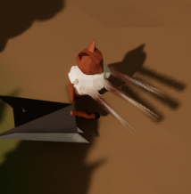

__Location:__ DungeonGourmet/Content/Characters/MainCharacter/BP_ThirdPersonCharacter; Content/Characters/MainCharacter/Weapons/BP_Knife; Models/ThrowingKnives (.fbx, .blend files);  

Knives (or rather forks in our case) can be thrown with a right mouse click. They have an internal cooldown of 2 seconds, but a corresponding widget has not been implemented. The knives are thrown in a cone in the character's facing direction. The spawning/throwing functionality has been implemented in the main character's blueprint, with the projectile itself implemented as an Actor. We modeled the forks ourselves in blender.

The main character has 3 invisible and collision-free spheres KnifeRef[LMR], which are used as references where to spawn the knives and in which direction to throw them. The implementation is called on the "InputAction Attack_2" event and consists of the controlflow that checks/sets the cooldown and obtains/releases the animation lock (only one animation at a time), and the actual spawning of the knives. To throw them in line of sight, the world rotation of the capsule component is specified. For the adjustment of the velocity rotation from the character to a specific knife instance, the relative rotation of the reference is provided. Futhermore, the local rotation (for mesh & collision box) of the knives is adjusted to the rotation of their velocity, i.e. their flight direction. With the activation of their projectile movement component the knives are thrown.

Knife velocity is adjusted by adding the velocity of the emitter to get an authentic throwing feeling. The collision of the projectile is set to collide with everything except pawns, for which overlapping events are generated. When overlapping with the enemy AI, it inflicts damage, whereby the projectile is first deactivated as well as made invisible and destroyed after a short delay to give the application enough time to display the damage numbers, as the projectile's speed is needed for their impulse.

Premature deletion of the projectile actor proved to be a source of many errors during implementation. Unfortunately, many error messages were misleading, as they usually pointed to another part of the blueprint that was working well. Also, in one of the first versions, the projectile threw enemies back and stunned them (which was implemented in the enemy AI blueprint), but this functionality kept crashing the game randomly. We have removed this part, as we could not find the underlying cause.

## Enemies
__Location:__ DungeonGourmet/Content/Characters/Enemy/**; Models/Enemy (.fbx, .blend files);  
We have implemented two enemy classes. In the game, these classes serve as the basis for the spawned enemies, which are further modified by the enemy spawner to be bigger/stronger or weaker/smaller. Both enemies use the same enemy AI controller with a behaviour tree, which specifies on which conditions the enemy pawn shall roam around, wait, chase the player/attack, and die. Futhermore those behaviours are defined in the associated behaviuor task blueprint. In order to detect the player we used a pawn sensing component. Enemies have Aside from appearance (mesh) and animations, both enemies differ in the way their attack is implemented. Each enemy has its unique idle, walk, attack, and death animation, which behaviours are defined in their animation blueprint classes, whereby the particular animations are in the Animation folder. We used a blendspace for the transition between idle and walk. On attack we play the corresponding animation in which we defined notifications, in order to know when to apply the attack.
### Skeleton
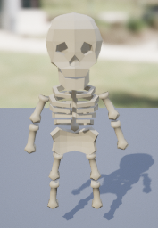  
On _Apply Attack_ we use sphere tracing in the range of the attack raduis in order to check if the attack hit and if so apply the damage to the player.
### Slime
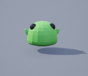  
Slime inherits the EnemyAI (Skeleton) class and overrides the _Apply Attack_ function to be empty, as the slime applies damage on overlap with the player character. Its attack animation is a forward thrust, which combined with the behaviour in the animation blueprint results in a dash ingame (increased velocity, no collision with pawns). Furthermore the slime glows on attack.

## Enemy waves
__Location:__ DungeonGourmet/Content/Blueprints/**;  

The enemy waves have been designed to teach the players the enemies first, before becoming a bigger challenge. The skeletons are introduced first, one skeleton at a time. In the second wave, the player must battle against several enemies at once, learning to deal with that specific situation. The slimes are introduced afterwards, once again with a single slime at first, then a single strong slime, and afterwards 2 slimes. 

Having learned the different enemy types, players must now face combinations of the two, with different themes to each fight. There is a wave consisting of many small enemies, a wave consisting of 2 massive slimes, 2 big random enemies and finally a battle against 10 strong enemies where 5 enemies can be on the screen at one time. 

## Enemy Wave Spawner
__Location:__ DungeonGourmet/Content/Blueprints/**;  

Enemys are spawned at predetermined locations. The logic is that each wave has a pool of enemys and they are randomly distributed to the spawn location. 
There are some parameters that can be set for the waves:
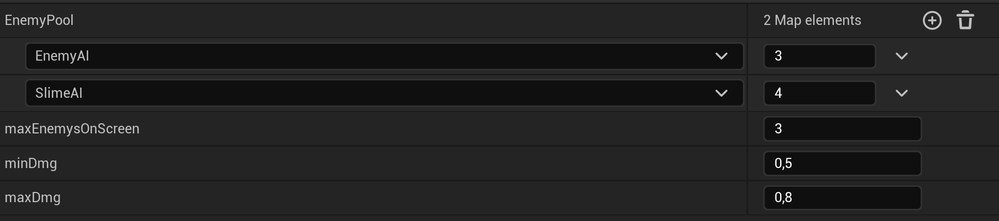

- A map for the enemy type and the number of these enemys
- maximum enemies on the screen 
- and a damage minimum and maximum multiplier to the base damage range

## Power Up System
__Location:__ DungeonGourmet/Content/Blueprints/PowerUpFolder;  

Players start the game with basic stats, which can be improved after each round. They have the option to choose from three different Powerups, each affecting certain stats in either a positive or negative way. To keep the system easy to manage, all powerups are stored in a JSON file, simplifying the process of balancing new powerups. When adding new stats or a new skill image, the existing powerups are not compromised.

## Audio
### Music
__Location:__ DungeonGourmet/Content/Audio/Music/**;  

There are 3 different tracks of music. A soothing background music for when our player does nothing, as well as a battle music, which plays whenever enemies attack the player. The music seemlessly switches between the 2 tracks using fade in/out.  

The last music track is for the main menu.

All tracks has been taken from [itch.io](https://alkakrab.itch.io/free-25-fantasy-rpg-game-tracks-no-copyright-vol-2)

### Effects
__Location:__ DungeonGourmet/Content/Audio/Effects/**;  

There are several audio effects in the game. The buttons of the ui have sounds when hovered and pressed, and the player and enemies make sounds at different times in the game. Basically all sound effects use a modulator to randomly change pitch and volume of the sound. 

The sounds are different sounds taken from various free to use websites, which were edited to length and filled with effects to reduce noise and unwanted sounds contained in the inital effects.

#### Main character
The chef cat has several effects: Footsteps whenever he is running around, a meow sound which is played during different actions and randomly aswell, attack sounds (sword swooshing), a roll sound, and a damage taken sound. The meow plays in random intervals as well as when damaged and sometimes when he rolls or attacks. 

The footsteps are cued when a specific frame in the animation happens. 

#### Enemies
The slime only has 2 different sound effects, a dash sound when he attacks, and a squishy sound which plays when damaged or when he hits the player. 

The skeletons are more similar to the main character, as they have footsteps linked to their animations as well. They also have different attack and damaged sounds, and a special sound for their death. 

## UI Widgets
The UI Widgets are Preset pages that are created seperrately and are faded in and out whenever needed.

### Ingame UI 
The functionality and the resources behind the ingame overlay can be found inside Content/UI/IngameOverlay.

The overlay consists of two elements which show the cooldown of the dodgroll and the amount of HP the character has. Both of them implemented using progress bars.

The dodge roll UI element receives time when the roll is available again and the cooldown time of the roll and calculates the percentage of how far the progress bar should be filled. The display is not perfectly accurate, as this leads to a better gamefeel.

There are also two counters displayed for the current Wave and the enemies remaining.

The Power Ups are randomised before they are filled into the Button element after a wave is completed. 

## Visual Effects
The visual effects on the camera, which were present during the last milestone of the game have been removed, as they did not match the wanted visuals. The main color scheme of the game is now determined by the materials of the assets, as well as the Skybox. This leads to the warm colors seen in the game. 

### Bloodsplosion

__Location:__ DungeonGourmet/Content/VFX/Bloodsplosion/**

The blood explosion effect is played when the enemy dies after their death animation. It has been implemented with the Niagara particle system by creating a custom material to obtain different particles. There is also the option to change the base colors of the explosions, which is used on our enemy characters where it is added as a component.

### Damage Numbers

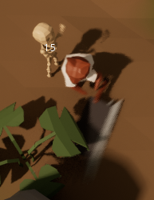

__Location:__ DungeonGourmet/Content/UI/FloatingCombatText/**

When the enemy takes damage, a text is displayed in the center of the enemy AI indicating the damage amount. After a short period of time, the displayed text fades out and moves upward. Note that when the AI is hit with a projectile, the displayed text is shot out of the enemy actor with a dampened impulse from the hitting projectile. This functionality is implemented under Content/UI/FloatingCombatText and consists of the following 3 parts:

__FloatingCombatText:__ The widget that contains the combat text. It is set to be always visible in screen space and contains a "FloatUpFadeOut" animation that starts linearly and transitions to a smooth curve (visible in the curve editor), with the displayed text gradually fading out and moving up. The text itself is set as a variable, since we want to define it dynamically at runtime. This can be done using the "Initialize" event defined in the blueprint graph. In addition, the playback speed is adjustable and a custom event is called after the widget animation is finished. This is needed in order to know when the associated actor can be deleted.

__BP_FloatingCombatText:__ The actor associated with the widget that is needed for the physics simulation. It is configured to be invisible and ignore all collisions. In addition to initializing the widget, it binds its destructor to the previously defined custom event and takes a velocity as input that is used as impulse for its movement. Since we don't want to shoot the displayed text too far away from the opponent, the length of the velocity vector is divided by 1000, multiplied by the input variable AbsLinearDampingFactor, and then set as a linear damping factor which allows us to adjust the distance it will traverse.

__BPC_DamageDisplay:__ The blueprint for a component that binds to its owner's damage event and creates a FloatingCombatText actor at the owner's position when it is triggered. This represents the final component added to the enemy AI blueprint.

This modular implementation style allows the combat text actor to be reused for displays other than damage, which can then be defined as another component analogous to BPC_DamageDisplay, which in turn can be added simply by adding the component to the respective actor.

### Player Damage Effect

__Location:__ DungeonGourmet/Content/UI/DamagedOverlay/**; DungeonGourmet/Content/Characters/MainCharacter/BP_ThirdPersonCharacter;

The player damage effect is created by shortly flashing widget with a red vignette when the player gets hit.