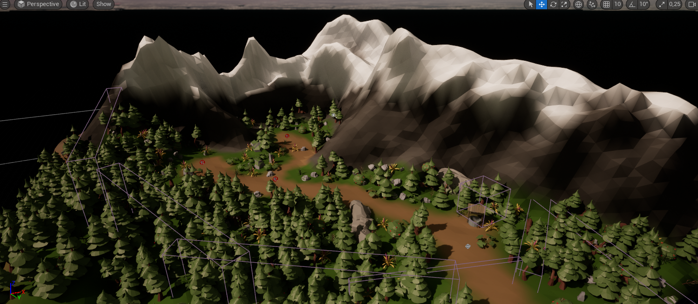

# Dungeon Gourmet
# Members
ai22m025 - Lukas Hartinger  
ai22m012 - Nico Winter  
ai22m007 - Philipp Lakheshar  

__Summary:__ Dungeon Gourmet is a roguelike action RPG implemented in the Unreal engine 5.2. In the game a meowster chef, armed with a giant cleaver and his throwing forks, embarks on a quest for the ultimate recipe. However, to his surprise, he encounters never-ending hordes of enemies, in which each wave he survives grants him one of three bonuses that make him stronger on his further journey.  

__Zusammenfassung:__ Dungeon Gourmet ist ein roguelike Action-RPG, das in der Unreal Engine 5.2 umgesetzt wurde. In dem Spiel begibt sich ein miausterhafter Koch, bewaffnet mit einem riesigen Hackbeil und seinen Wurfgabeln, auf die Suche nach dem ultimativen Rezept. Zu seiner Überraschung trifft er jedoch auf nicht enden wollende Horden von Feinden, wobei ihm jede überlebte Welle einen von drei Boni gewährt, die ihn auf seiner weiteren Reise stärker machen.

# Original Concept

## Idea
Our original idea was a rougelite action RPG with two gameplay loops, an inner (main) gameplay loop that lets the player slay enemies in an outdoor dungeon, with the player receiving loop-instanced upgrades after each wave, and a persistent outer loop that allows the player to combine and use loot obtained in the main loop to obtain permanent power-ups or change the overall gameplay. Due to time constraints, we have not implemented the outer game loop, but the game can still be expanded to include it.

## Genre & Target Audience
Roguelike Action RPG with top-down view. We want to appeal to casual players with the accessible; child-friendly art style and non-casual players with the restrictive combat system. We aim for a medium difficulty level that neither discourages nor bores either group. 

## Gameplay Feeling
Heavy, calculated gameplay where every move counts. The weight of the sword and the body type of the cat boss should be reflected in the gaming experience.

## Art Style
Low-poly assets with warm colors. Outside dungeons rather than indoors, but still quite mysterious and with high contrast. The main character is
different from the world around him due to the strong contrast and different color scheme
around him. The world is 3D, low-poly and cartoony. See the moodboard.

## Platform
Windows

## Development Environment
The game was implemented in Unreal 5.2.  
A possible switch to Unity was considered, but ultimately discarded due to time constraints. If we were to start from scratch, Unity seems more suitable in retrospect.

# Implemented Features
## Basic Movement & Camera Settings
__Location:__ DungeonGourmet/Content/Characters/MainCharacter/BP_ThirdPersonCharacter

### Movement
The basic movement is based on the position and orientation of the camera. The player can use the W, A, S, D keys to move on a plane parallel to the XY plane. We simply use the xy parts of the camera's forward vector and normalize them to get the direction we want our character to move when we make the up/down and left/right inputs. Everything else is done automatically by UE. We initially implemented this to only go in +/- x/y direction, but when we changed the camera perspective, it was pretty obvious that the previous implementation wouldn't be enough.

### Camera
As we want to have a top-down roguelike, we had to move the camera in a fairly specific way. It is centered a bit away, centered on our main character and supports a fairly wide FOV, as the world surrounding our character could not be seen otherwise.  
We also used the camera's post-processing options to give our game more of the look and color scheme suggested in our GDD's mood board. To do this, we applied gamma correction, additional gain and color offset. This initially resulted in a more earthy, green look, which was desirable as we were aiming for a more nature-like appearance, but it proved to be hard on the eyes, so after some trial and error we adjusted the parameters to a more neutral and not too contrasty look.

## Level

## Main Character Model & Main Weapon

## Main Character Animations
## Throwing Knives
## Dodge Roll
## Slash Attack
## Enemies
## Enemy Wave Spawner
## Power Up System
## Audio
## UI Widgets
## Visual Effects
### Bloodsplosion
### Damage Numbers
### Player Damage Effect